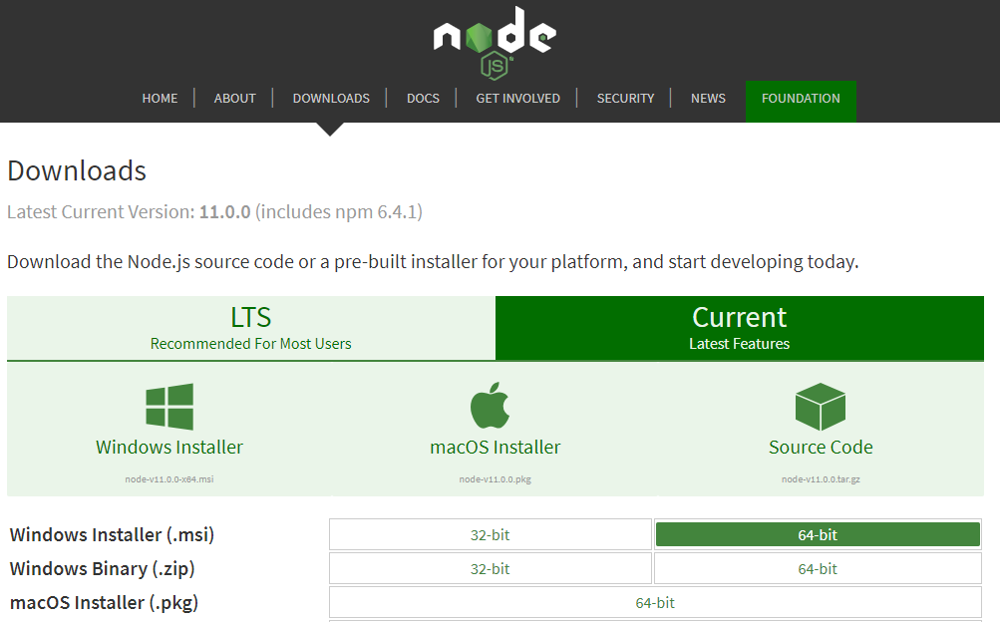
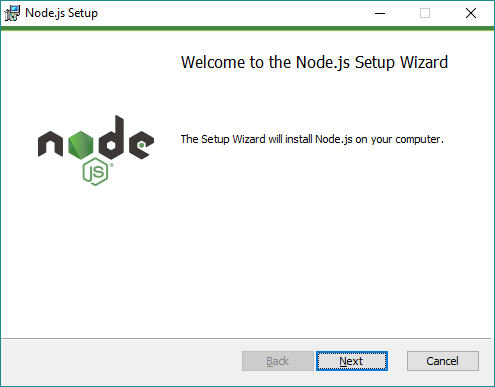
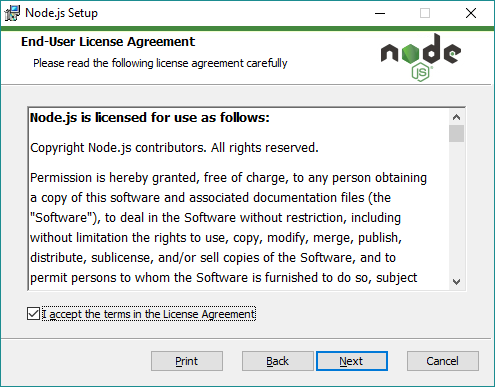
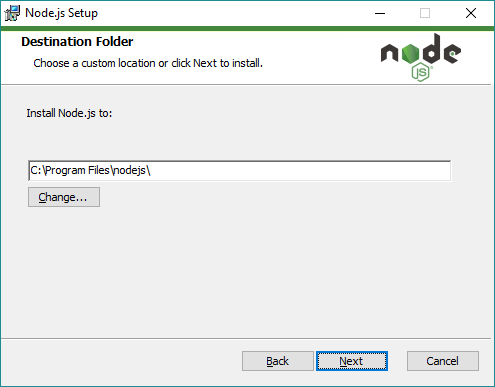
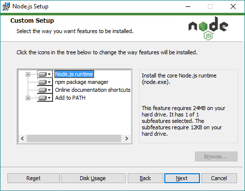
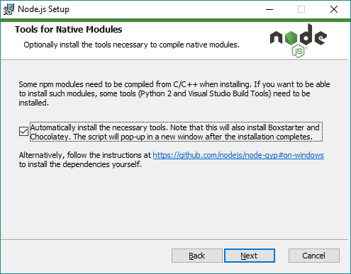
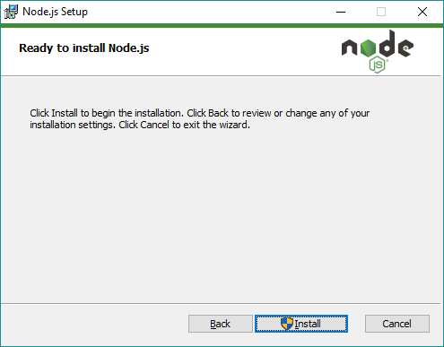
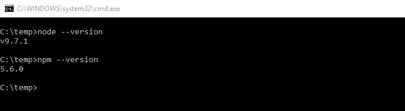

## 1.1 Ambiente Windows

## Instalação do NodeJS e npm no Windows (Passo a passo!).

Para instalar o nodejs e o npm no windows, primeiro você precisa acessar a página de downloads do <https://nodejs.org/en/download/> para baixar o instalador.

Geralmente tem duas versões da LTS que tem suporte a longo prazo e a current é a última versão. Neste momento a versão LTS é a 16.16.0.

  

  

* Escolha a versão de sua preferência e baixe o instalador parar o sistema operacional.
* Após baixar, execute o instalador.

  

  

* A primeira tela do instalador do NodeJs apresenta uma mensagem de boas vindas do instalador informando que será instalado o Node.js no seu computador, basta clicar em Next para continuar.

  

  

* A segunda tela do instalador do NodeJs pede para ler a licença de uso e aceitar os termos. Se você concordar com os termos, marque a caixinha I accept ... e clique em Next para continuar.

  

  

* A tela seguinte oferece a opção de alterar a pasta onde o NodeJS será instalado, escolha o local da instalação e clique em Next para continuar.

  

  

* Em seguida o instalador permite personalizar algumas opções da instalação como adicionar ou não o caminho do node e npm na variável PATH, etc. Eu deixo todas as opções marcadas. Clique em Next para continuar.

  

  

* Na sequência o instalador pergunta se queremos instalar as ferramentas necessárias para compilar módulos nativos. Se você marcar a caixinha para instalar essas ferramentas, o instalador vai iniciar outra janela para instalar essas ferramentas. Eu marquei, escolha se você deseja essa opção e Clique em Next para continuar.

  

  

* Pronto! Agora basta clicar em Install para iniciar a instalação. O Windows vai pedir permissão de administrador para instalar o NodeJS.

Terminada a instalação clique em Finish e pronto.

Para verificar se o node e o npm foi instalado corretamente, basta executar node --version e npm --version na linha de comando conforme a imagem abaixo.

  

  